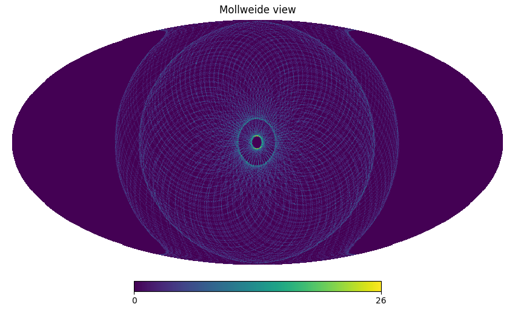

# Serial simulation tutorial in RURI

The simulation starts at t0=0 and lasts 86400.0 seconds.

The seed used for the random number generator is 12345.

[TOC]

## Generation of spacecraft quaternions

Quaternions have been created for the simulation:

- One quaternion every 60.0 seconds;
- Memory usage: 46.1 kB

## Coverage map

Here is the coverage map:

The fraction of sky covered is 70628/196608 pixels
(35.9%).

The total number of hit is 172800.0

## Instrument model objects

## Source code used in the simulation

-   Main repository: [github.com/litebird/litebird_sim](https://github.com/litebird/litebird_sim)
-   Version: 0.10.0, by The LiteBIRD simulation team
-   Commit hash: [16311c0](https://github.com/litebird/litebird_sim/commit/16311c01e4464a2affd9c6d301314d5e0fcb4bbc)
    (commit comment: *test*, by yusuke-takase)

The command `git diff` was skipped. Use `include_git_diff = True` when
calling `Simulation.flush()` to enable it.
---

Report written on 2023-09-06 15:25:39

